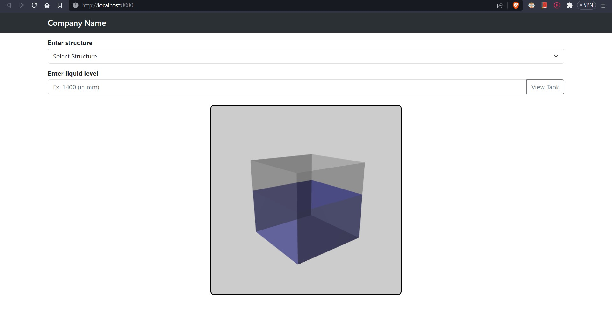
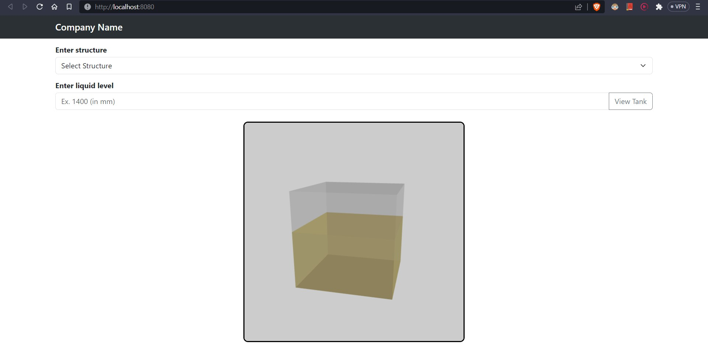

# 3D visualization

**NOTE : Please click on View Tank button to have these views**

Commands
1. `git clone https://github.com/indira1vik/second-task-tanks.git`
2. Open in IDE And in terminal and copy the below commands
```
wasm-pack build --target bundler
cd pkg
npm link
cd ../site
npm link <folder>(trial)
npm install
npm run serve
```
3. To make any other changes :
```
wasm-pack build --target bundler
npm run serve
```





